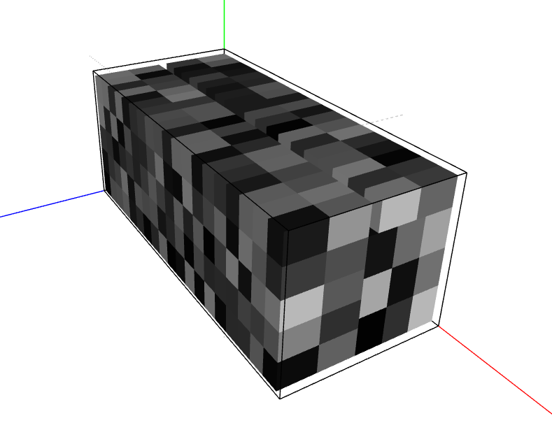

# BinPack Solver With Instructions

## Setup Instructions

1. Create a virtualenv with `python -m virtualenv venv`
2. Activate the virtualenv (using appropriate script in venv/Scripts)
3. Install dependencies with `pip install -r requirements.txt`

## Running the solver

1. Place input parameters in `input.json`
2. Run `python main.py`
3. Output will be presented in `output.json`, statistics of the packing will be displayed on the terminal


## Visualization



To visualize your packing process , go to [binpack-viewer.amith.ml](https://binpack-viewer.amith.ml/) and drag and drop the generated `viz.json` file


## Example Output


```
❯ python main.py
Completed solving with 93.07% fill. (6.93% trim loss)
Generated 45 instructions after simplification.
Find results in output.json
```
